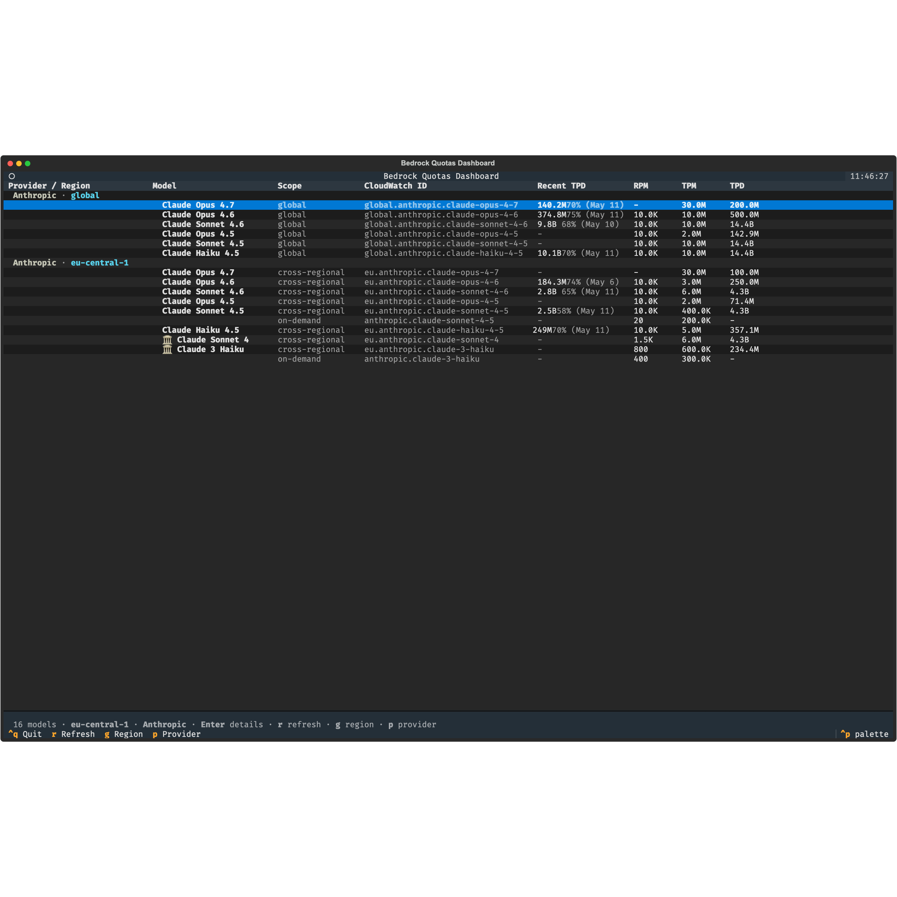
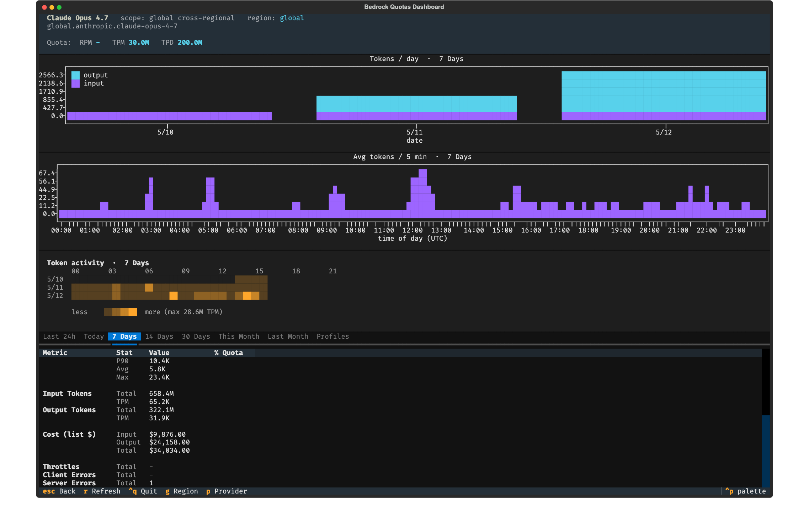
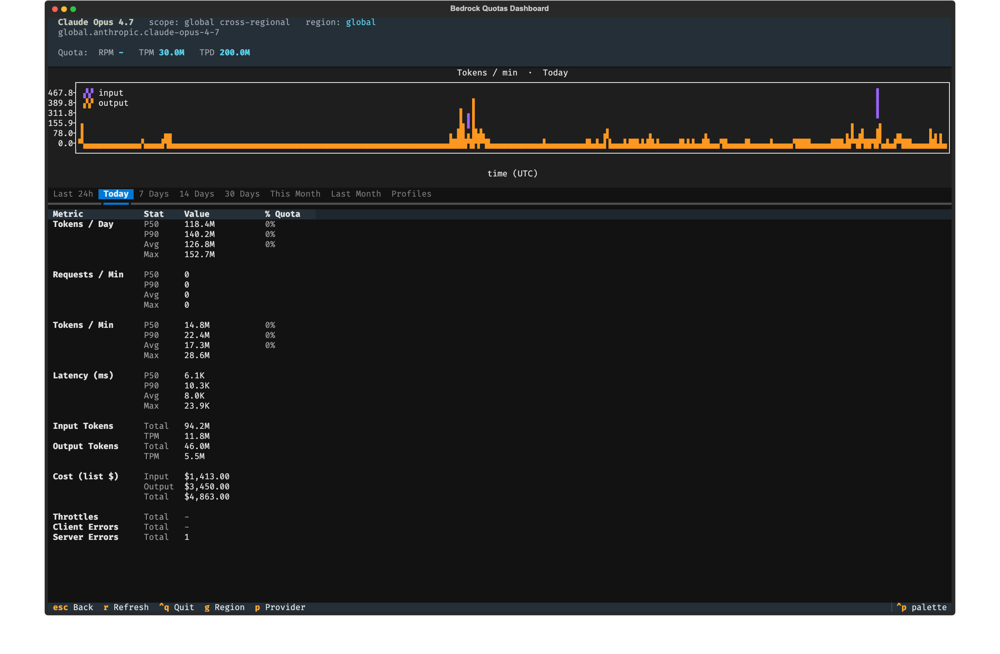

# bedrock-quota

A CLI-based dashboard to see your AWS Bedrock model quotas and usage.

[](https://pypi.org/project/bedrock-quota/)
[](https://pypi.org/project/bedrock-quota/)
[](LICENSE)
[](https://github.com/Kelet-ai/bedrock-quota/actions/workflows/release.yml)
[](https://pypi.org/project/bedrock-quota/)




The AWS console shows quota limits on one page and CloudWatch usage on another — nothing joins them per model. `bedrock-quota` pulls both and shows headroom per model, per region, so you know where you stand before you scale. Read-only, no dashboard to maintain.

## Features

- **Know your headroom** — RPM, TPM, TPD quotas next to last-day usage, per model.
- **Spot throttle risk early** — ⚠ flagged when 7-day P90 TPM crosses 80% of quota.
- **Every variant in one table** — on-demand, cross-region, and global cross-region inference profiles.
- **Drill into a model** — per-period stats, stacked token charts, hourly heatmap, per-inference-profile breakdown.
- **Multi-region view** — each region loads independently, shown as a separate section.
- **Keyboard-first** — works over SSH, 5-minute metric cache.

## Install

```sh
uvx bedrock-quota                # try without installing (recommended)
uv tool install bedrock-quota    # or install as a uv tool
pipx install bedrock-quota       # or via pipx
pip install bedrock-quota        # or plain pip
```

## Quickstart

```sh
AWS_PROFILE=my-sso-profile AWS_DEFAULT_REGION=us-east-1 bedrock-quota
```

Credentials are picked up like any other AWS CLI tool — `AWS_PROFILE`, SSO, environment variables, or an attached instance role.

## IAM permissions

Most developers already have enough read-only access through their SSO or dev IAM role and can skip this section. If you need to scope a dedicated policy, this is the minimum:

```json
{
  "Version": "2012-10-17",
  "Statement": [
    {
      "Effect": "Allow",
      "Action": [
        "bedrock:ListFoundationModels",
        "bedrock:ListInferenceProfiles",
        "bedrock:ListTagsForResource",
        "cloudwatch:GetMetricData",
        "cloudwatch:ListMetrics",
        "pricing:GetProducts",
        "servicequotas:ListServiceQuotas"
      ],
      "Resource": "*"
    }
  ]
}
```

## Keyboard shortcuts

| Key      | Action                     |
| -------- | -------------------------- |
| `g`      | Switch / add region        |
| `p`      | Switch provider            |
| `r`      | Refresh data               |
| `Enter`  | Open model detail screen   |
| `Escape` | Back / close               |
| `Ctrl+Q` | Quit                       |

## Model detail

Press `Enter` on any row to open a per-model detail screen with stats (P50/P90/Avg/Max for TPD, RPM, TPM, latency), token charts, an hourly heatmap, and a per-inference-profile breakdown — for time periods Last 24h, Today, 7d, 14d, 30d, This Month, Last Month.



## Troubleshooting

- **No usage data** — CloudWatch only records metrics for models you've actually invoked. Check that `AWS_DEFAULT_REGION` matches the region you're calling Bedrock in.
- **Slow first load** — the first run queries CloudWatch for every model across every time period; subsequent loads hit the 5-minute cache. Press `r` to force-refresh.
- **Credentials error** — run `aws configure`, `aws sso login`, or set `AWS_ACCESS_KEY_ID` / `AWS_SECRET_ACCESS_KEY` / `AWS_DEFAULT_REGION`.

## Implementation notes

Usage data is queried from CloudWatch (`AWS/Bedrock` namespace, `ModelId` dimension): `InputTokenCount` + `OutputTokenCount` → TPM/TPD, `Invocations` → RPM, `InvocationLatency` → latency, `InvocationThrottles` / `InvocationClientErrors` / `InvocationServerErrors` → error counts. Quotas come from AWS Service Quotas. Model IDs are discovered from `ListFoundationModels`, `ListInferenceProfiles`, and observed CloudWatch dimensions, so cross-region variants like `us.anthropic.claude-sonnet-4-6` match their quota automatically. Per-token costs shown in the detail screen are list prices from the AWS Pricing API (`pricing:GetProducts`); they exclude Savings Plans and batch-inference discounts. If `pricing:GetProducts` is not granted, cost rows render `—` and the status bar shows a note.

## Development

```sh
git clone https://github.com/Kelet-ai/bedrock-quota
cd bedrock-quota
uv sync
uv run bedrock-quota
```

## License

[MIT](LICENSE)
